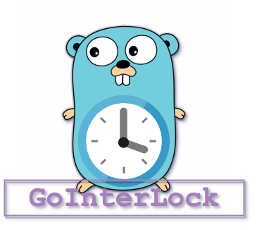

# goInterLock


## **Go**lang **Interval** job timer, with distributed **Lock**

`goInterLock` is golang job/task scheduler with distributed locking mechanism. In distributed system locking is prevent task been executed in every instant that has the scheduler, For example, if your application has a task of calling some external APIs or doing some DB querying every 10 minutes, the lock prevents the process been run in every instance of that application and you ended up running that task multiple time every 10 minutes.

Quick Start

```shell
go get github.com/ehsaniara/gointerlock
```

# Local Scheduler (Single App)

(Interval every 2 seconds)

```go
var job = gointerlock.GoInterval{
    Interval: 2 * time.Second,
    Arg:      myJob,
}
err := job.Run(ctx)
if err != nil {
        log.Fatalf("Error: %s", err)
}
```

# Distributed Scheduler (Scaled Up)

## Existing Redis Connection
you should already configure your Redis connection and pass it into the `GoInterLock`. Also make sure you are giving the
unique name per job

Step 1: configure redis connection `redisConnection.Rdb` from the existing application and pass it into the Job. for example:
```go
var redisConnector = redis.NewClient(&redis.Options{
    Addr:     "localhost:6379",
    Password: "myRedisPassword", 
    DB:       0,               
})
```
Step 2: Pass the redis connection into the `GoInterval`

```go
var job = gointerlock.GoInterval{
    Interval: 2 * time.Second,
    Arg:      myJob,
    Name:     "MyTestJob",
    RedisConnector: redisConnector,
}
err := jobTicker.Run(ctx)
if err != nil {
    log.Fatalf("Error: %s", err)
}
```

in both examples `myJob` is your function, for example:

```go
func myJob() {
	fmt.Println(time.Now(), " - called")
}
```
_Note: currently `GoInterLock` does not support any argument for the job function_

### Built in Redis Connector

another way is to use an existing redis connection:

```go
var job = gointerlock.GoInterval{
    Name:          "MyTestJob",
    Interval:      2 * time.Second,
    Arg:           myJob,
    RedisHost:     "localhost:6379",
    RedisPassword: "myRedisPassword", //if no pass leave it as ""
}
err := job.Run(context.Background())
if err != nil {
    log.Fatalf("Error: %s", err)
}
```

##### GoInterLock is using [go-redis](https://github.com/go-redis/redis) for Redis Connection.


## Examples
[**Basic Task:**](./example/basic) Simple Task Interval with Redis Lock. 

[**Application Cache:**](./example/applicationCache) An example of periodically cached value update on http server.
